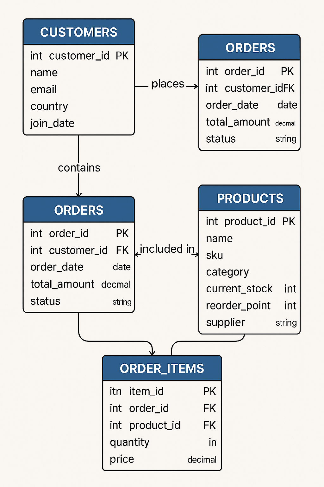
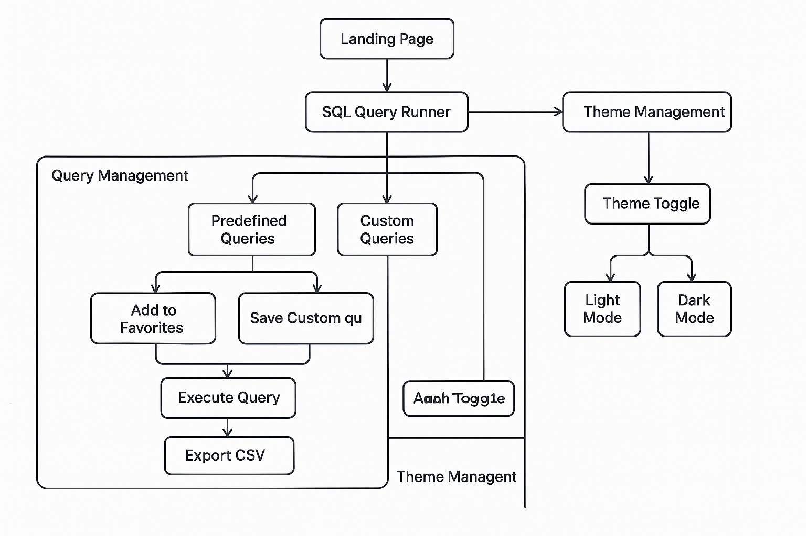
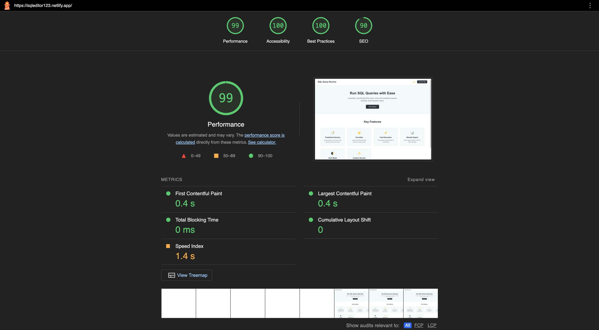
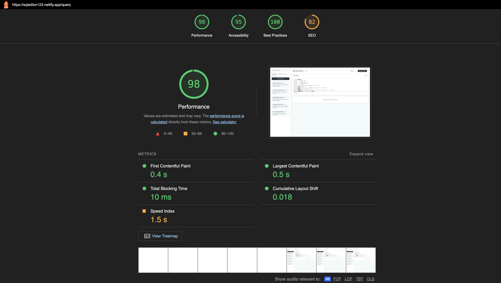

# 📊 Atlan Frontend Internship Task 2025

## Overview

This project is a web-based SQL query application designed for Atlan's frontend internship task. The application allows users to input SQL queries, execute them (mocked results), and view the output in a structured table format. The application is built using React and optimized for performance.

## 🔧 Tech Stack

- Framework: React
- Styling: CSS
- Hosting: Netlify
- Libraries Used:
  - Ace Editor (ace-builds, react-ace) for SQL query input
  - React Router (react-router-dom) for navigation
  - Vite for fast builds and development environment

## 🚀 Features

- **Execute Predefined Queries**: Run a set of predefined SQL queries and view the results instantly.
- **Query Management**: Users can manage their SQL queries, edit them, and organize them efficiently.
- **Toggle Between Dark & Light Mode**: Supports a theme switcher for user preference.
- **Favorite Queries**: Users can add frequently used queries to their favorites for quick access.
- **Query History**: Users can view and revisit previously executed queries for reference and reuse.
- **Copy Query Functionality**: Easily copy queries with a single click for reuse.
- **Random Data Generator**: Generates mock data dynamically for executing queries.
- **Export Data**: Allows users to export query results in CSV.
- **Predefined Query Selection**: Users can toggle between predefined queries.
- **Optimized UI/UX**: Ensures smooth navigation and efficient rendering for the best user experience.

## 📊 Application Architecture

### ER Diagram

### Flow Diagram

## ⚡️ Performance Analysis

The performance of the application was analyzed using Google Lighthouse and Chrome DevTools. The key metrics measured include:

### Page Load Time

- Landing page Load Time: [985 ms]
- Editor page Load Time: [1.90 s]
- Measured using Lighthouse performance audits in Incognito mode

### Optimizations Implemented

To enhance performance and reduce page load time, the following optimizations were made:

- Optimized Asset Delivery: Compressed images and minimized CSS/JS files.
- Efficient State Management: Used minimal re-renders and efficient state handling.
- CDN Caching: Leveraged hosting platform's built-in caching for faster content delivery.
- Minimal Dependencies: Avoided unnecessary third-party libraries to keep the bundle size small.

## 📸 Screenshots

### Lighthouse Performance Report

## 📜 Submission Details

- GitHub Repository: https://github.com/vanshbulchandani/frontend-2025-test
- Live Demo: https://sqleditor123.netlify.app/
- Architecture Diagram & Documentation: https://docs.google.com/document/d/1eezuh8KKMCYGPSeBP9w10XQGU8TQoZ1bLOuj1wNzSBw/edit?usp=sharing
- Video Walkthrough: https://drive.google.com/file/d/16KWr9KWU_ybx6iOmeesrOeAbzemEIi8H/view?usp=drive_link

## ✅ Judging Criteria Considerations

- Thoughtful feature planning & implementation
- Performance optimization & low load time
- Code structure, readability, and maintainability
- Smooth user experience with minimal lag

## 🏆 Brownie Points Achieved

- Efficient handling of large datasets without browser crashes
- Smooth query toggling mechanism
- Optimized rendering techniques for performance boost

---

Note: This is a dummy application and does not have a real backend or actual query execution engine. It is designed for evaluation purposes only.
